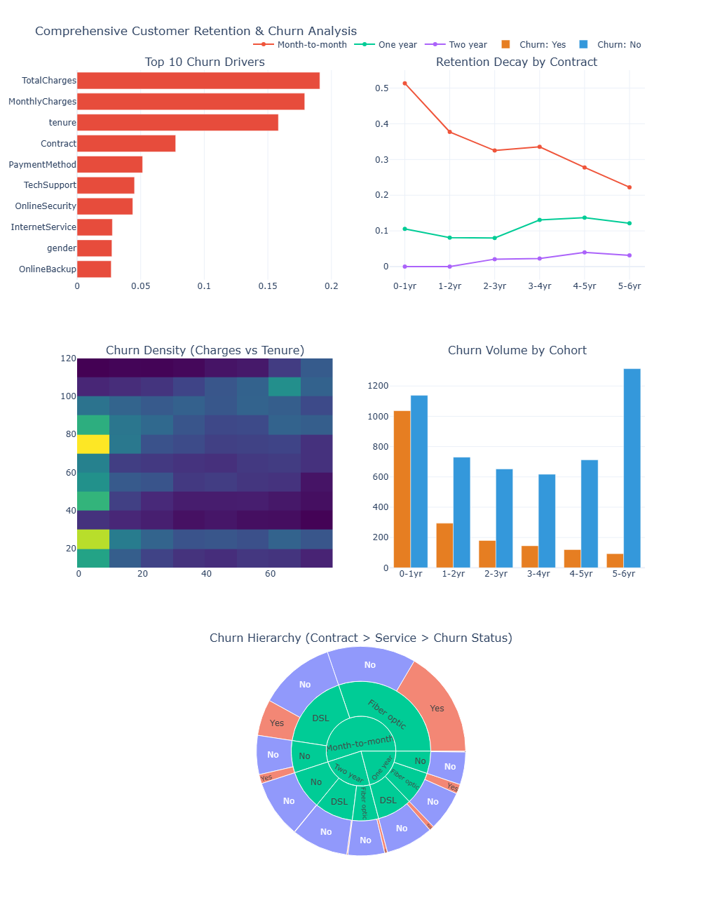

# FUTURE_DS_02
# Customer Retention & Churn Analytics: Telco Industry Deep-Dive

## 📌 Project Overview
This project analyzes customer attrition for a subscription-based telecommunications provider. By leveraging customer demographics, service usage, and contract details, I identified the primary drivers of churn and developed actionable strategies to improve long-term retention and revenue stability.

This analysis was completed as part of the **Future Interns** analytics program, focusing on moving from student-level data processing to job-ready business intelligence.

## 📊 Business Problem
In a competitive SaaS/Subscription environment, keeping an existing customer is more profitable than acquiring a new one. This project addresses:
*   **Why** customers leave the platform.
*   **Which** segments (Contract, Service, Tenure) are at the highest risk.
*   **How** the business can proactively intervene to reduce loss.

## 🛠️ Tech Stack
*   **Language:** Python (Google Colab)
*   **Libraries:** `Pandas`, `NumPy`, `Plotly`, `Scikit-Learn`
*   **Machine Learning:** Random Forest Classifier for Feature Importance.
*   **Visualizations:** Interactive Multi-row Dashboards, Sunburst Hierarchies, and Cohort Analysis.

## 🔍 Key Insights

### 1. The "Contract Type" Trap
The **Top 10 Churn Drivers** analysis identifies **Month-to-Month** contracts as the single largest predictor of churn. These users lack the commitment of annual plans and are 3x more likely to leave.

### 2. Early-Stage Retention Decay
The **Retention Decay** and **Churn Volume** charts reveal a "Danger Zone" in the first **0–12 months**. Customers who survive the first year show a significantly higher probability of long-term loyalty.

### 3. Service & Hierarchy Friction
The **Churn Hierarchy (Sunburst)** highlights that **Fiber Optic** users churn at higher rates than DSL users, suggesting that premium price points must be matched with superior technical support to ensure satisfaction.

## 💡 Strategic Recommendations
*   **Conversion Incentives:** Launch campaigns to migrate Month-to-Month users to 1-year plans using loyalty discounts.
*   **Proactive Onboarding:** Implement a "Customer Success" check-in at the 2-month mark for all new subscribers to resolve technical friction early.
*   **Price-Value Optimization:** Audit the Fiber Optic service experience to ensure technical stability justifies the higher monthly charges.

## 🚀 How to Use This Repository
1.  **Notebook:** Open `Telco_Customer_Churn.ipynb` in Google Colab.
2.  **Data:** Ensure `WA_Fn-UseC_-Telco-Customer-Churn.csv` is uploaded to the environment.
3.  **Output:** Run the cells to generate the interactive dashboard and the `Cleaned_Telco_Churn.csv` file.

---
*Developed by Sbusiso Gift as part of the Future Interns Data Analytics Task.*
*Connect with me on [LinkedIn](www.linkedin.com/in/sbusiso-mtimunye-5a5451254) to discuss data-driven growth!*
